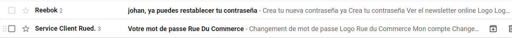
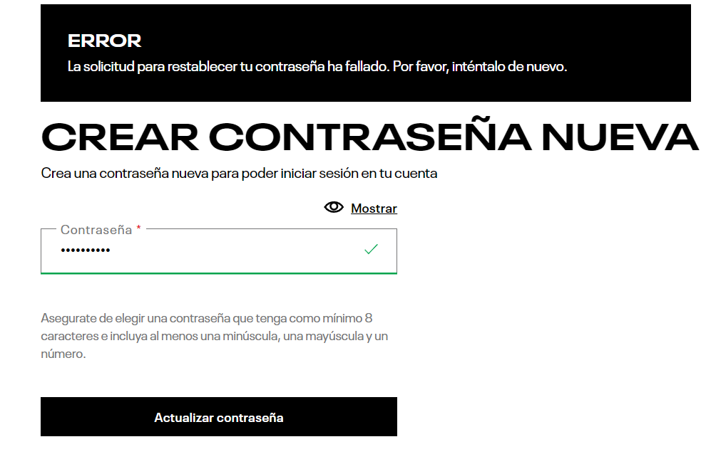
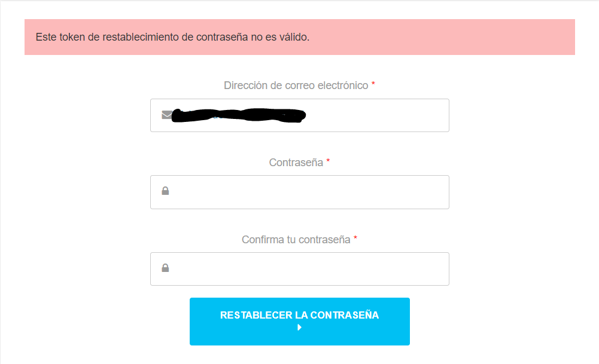

# Descripción
En este repositorio, se encuentran los códigos utilizados para automatizar el registro de usuario, el inicio de sesión de usuario, la modificación de contraseña (requiere inicio de sesión), y el reestablecer la contraseña (no requiere inicio de sesión) y tambien usar fuerza bruta para el ingreso a una cuenta, en dos paginas web, una chilena y otra francesa. El código fue escrito en Python, en conjunto con el entorno de prueba Selenium.

Para poder ejecutar estos codigos de debe tener instalado Selenium (https://selenium-python.readthedocs.io/installation.html) y tambien haber descargado chromedriver, teniendo en cuenta la version del navegador Google Chrome para la descarga (https://chromedriver.chromium.org/). El ejecutable "chromedriver.exe" debe estar en la misma carpeta donde estan los codigos.

Las paginas auditadas fueron las siguientes:
* sitio Frances: https://www.rueducommerce.fr/
* sitio Chileno: https://www.reebok.cl/

## Desarrollo Actividades

#### 1) Registro

Para automatizar el registro de los sitios web, se utilizaron los codigos indicados a continuación:

* sitio Frances: RegistroRuedu.py
* sitio Chileno: RegistroReebok.py

En los codigos en la variable "username" poner un correo de ejemplo, como se muestra a continuación:

* username = "ejemplocorreo@gmail.com"

#### 2) Login

Para automatizar el login de los sitios web, se utilizaron los codigos indicados a continuación:

* sitio Frances: LoginRuedu.py
* sitio Chileno: LoginReebok.py

En los codigos en la variable "username" poner el correo usado anteriormente para el registro.

#### 3) Fuerza bruta en login

Para aplicar fuerza bruta en el login de los sitios web, se utilizaron los codigos indicados a continuación:

* sitio Frances: LoginFuerzaBrutaRuedu.py
* sitio Chileno: LoginFuerzaBrutaReebok.py

En los codigos en la variable "username" poner el correo usado anteriormente para el registro.
Se puede ver en los codigos que, se intenta 20 veces ingresar a la cuenta del correo ingresado, pero en solo en una oportunidad se puede ingresar (al tercer intento, ya que en esa posición del arreglo se puso la contraseña correcta). 

##### 4) Cambio de contraseña

Para automatizar el cambio de contraseña de los sitios web, se utilizaron los codigos indicados a continuación:

* sitio Frances: CambioContraseniaRuedu.py
* sitio Chileno: CambioContraseniaReebook.py

En los codigos en la variable "username" poner el correo usado anteriormente para el registro y en la variable "newPassword", poner la contraseña nueva, como se muestra a continuación:

* newPassword = "Password1234"

#### 5) Recuperar contraseña

Para automatizar la recuperación de contraseña de los sitios web, se utilizaron los codigos indicados a continuación:

* sitio Frances: RecuperarContraseniaRuedu.py
* sitio Chileno: RecupererContraseniaReebok.py

En los codigos en la variable "username" poner el correo usado anteriormente para el registro.
Cabe mencionar que en ambos sitios, fue posible automatizar la recuperación de la contraseña hasta el punto, de que llegara el link al correo para recuperar la contraseña, como se muestra en las siguientes imagenes:

No se pudo automatizar mas, debido a que se generaba un token en ambas paginas, el cual era para solo un uso, por lo cual al intentar dos veces cambiar la contraseña con el mismo link que llegaba al correo, mostraba un error, como se muestra en las siguientes imagenes:

<iframe src="https://player.vimeo.com/video/709375876?h=b556063de2" width="640" height="564" frameborder="0" allow="autoplay; fullscreen" allowfullscreen></iframe>

https://vimeo.com/709375876

